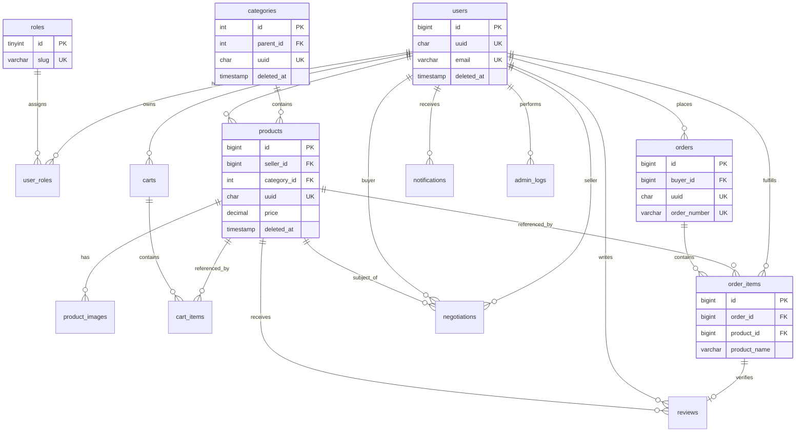

# Entity-Relationship Diagram (ERD)

Omnes Marketplace uses a **normalized 3NF** schema: each fact is stored once, foreign keys enforce relationships, and denormalized snapshots exist only where history must be preserved (order line items).

## High-level diagram



## Entity summary

| Entity | Purpose | Soft delete |
|--------|---------|-------------|
| `users` | Accounts (buyers, sellers, admins) | `deleted_at` |
| `roles` / `user_roles` | RBAC | — |
| `categories` | Product taxonomy (tree via `parent_id`) | `deleted_at` |
| `products` | Listings | `deleted_at` |
| `product_images` | Media per product | `deleted_at` |
| `carts` / `cart_items` | Shopping session | — |
| `orders` / `order_items` | Purchase history (immutable snapshots) | orders only |
| `negotiations` | Price offers between buyer and seller | `deleted_at` |
| `notifications` | User inbox | — |
| `reviews` | Product ratings | `deleted_at` |
| `admin_logs` | Audit trail (append-only) | — |

## UUID strategy

| Table | UUID | Rationale |
|-------|------|-----------|
| `users`, `products`, `orders`, … | `CHAR(36)` | Safe public API identifiers |
| Junction / line tables | Internal `BIGINT` only | Never exposed externally |

Internal joins use `BIGINT` primary keys for performance; UUIDs are used in URLs and external integrations.

## Cascade rules (orphan prevention)

| Parent → Child | ON DELETE | Rationale |
|----------------|-----------|-----------|
| `users` → `user_roles` | CASCADE | Roles are meaningless without user |
| `users` → `carts` | CASCADE | Cart belongs to user |
| `users` → `orders` | **RESTRICT** | Preserve financial history |
| `users` → `products` (seller) | **RESTRICT** | Force soft-delete seller first |
| `products` → `product_images` | CASCADE | Images are dependent |
| `products` → `order_items` | **RESTRICT** | Orders reference live product row |
| `orders` → `order_items` | CASCADE | Lines die with order |
| `categories` → `products` | SET NULL | Category removal uncategorizes only |
| `users` → `notifications` | CASCADE | Inbox tied to user |

**Soft delete** is used for `users`, `products`, `categories`, `reviews`, and `negotiations` so historical FKs remain valid without `SET NULL` on commerce data.

## Role system

```
roles (buyer | seller | admin)
   └── user_roles (many-to-many, typically one role per user in seed data)
```

- **Buyer**: cart, orders, negotiations, reviews  
- **Seller**: products, negotiations (as seller), order fulfillment via `order_items.seller_id`  
- **Admin**: `admin_logs` writer; enforced in application layer  

## Key constraints

- Email format check on `users.email`
- Prices and quantities `>= 0` (or `>= 1` for quantities)
- Review rating `1–5`
- Negotiation: `buyer_id <> seller_id`
- One active cart per user (functional unique index on `carts`)

## Order snapshot pattern

`order_items` stores `product_name`, `product_slug`, `unit_price`, and `line_total` at purchase time so catalog changes never rewrite history.
